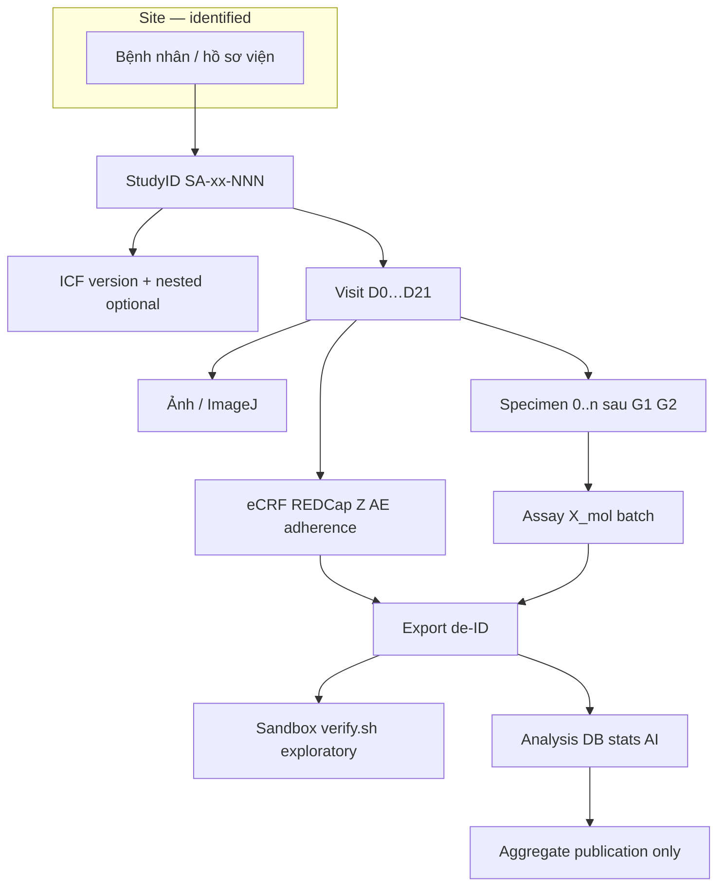

# PB-004 — sơ đồ 1 trang (slide nội bộ)

**Mã:** PB-004-DIAGRAM-v0.1  
**Ngày:** 2026-09-16  
**Curriculum:** Ngày 21 · `worksheets/PB-004-data-architecture.md`

## Sơ đồ (copy slide)

## Consent tách lớp

| Lớp | Consent |
|-----|---------|
| RCT + \(Z\) dọc | ICF chính |
| Lưu mẫu / omics | ICF nested `ICF-NEST-SA01-v0.1-DRAFT.md` |

## Ranh giới agent / Git

- **Không** PII trong repo · Drive pointer only · xem `y-te-so-precure-bridge-v0.1.md`

## Việc nhỏ

- [x] Sơ đồ 1 trang (file này) — tick worksheet PB-004 khi ritual  
- [ ] PI: export slide PNG nội bộ nếu cần họp Smart A

## Liên kết

- `reading-notes/2026-10-07-pb004-consent-data.md` · problem-bank PB-004
